# [Kartografische_Zeitmaschine](https://github.com/mjwalz/Kartografische_Zeitmaschine)

Let the data tell a story.

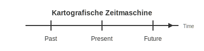
**Test image*

> **Note**: For detailed information about the QGIS/GeoDjango integration, see that [README](apps/README.md).

## Milestones

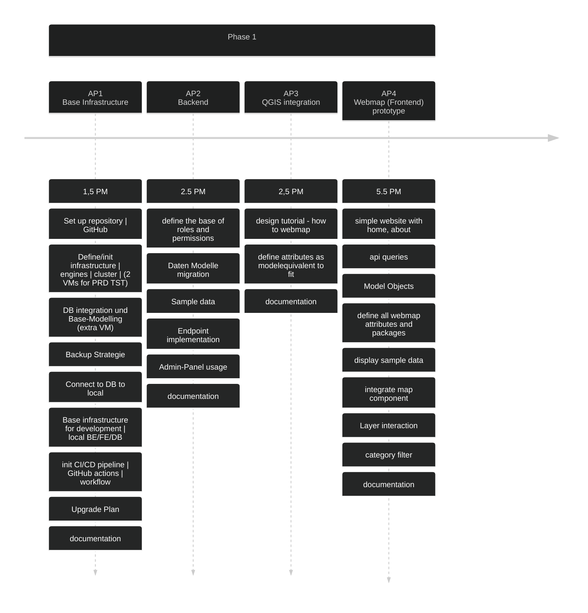
```mermaid
---
config:
  theme: 'dark'
---
timeline
    section Phase 1 
    AP1 <br> Base Infrastructure
    : 1,5 PM
    : Set up repository | GitHub
    : Define/init infrastructure | engines | cluster | (2 VMs for PRD TST)
    : DB integration und Base-Modelling (extra VM)
    : Backup Strategie
    : Connect to DB to local
    : Base infrastructure for development | local BE/FE/DB
    : init CI/CD pipeline | GitHub actions | workflow
    : Upgrade Plan
    : documentation
    AP2 <br> Backend
    : 2.5 PM
    : define the base of roles and permissions
    : Daten Modelle migration
    : Sample data
    : Endpoint implementation
    : Admin-Panel usage
    : documentation
    AP3 <br> QGIS integration
    : 2,5 PM
    : design tutorial - how to webmap
    : define attributes as modelequivalent to fit 
    : documentation
    AP4 <br> Webmap (Frontend) prototype
    : 5.5 PM
    : simple website with home, about
    : api queries
    : Model Objects
    : define all webmap attributes and packages
    : display sample data
    : integrate map component
    : Layer interaction
    : category filter
    : documentation
```

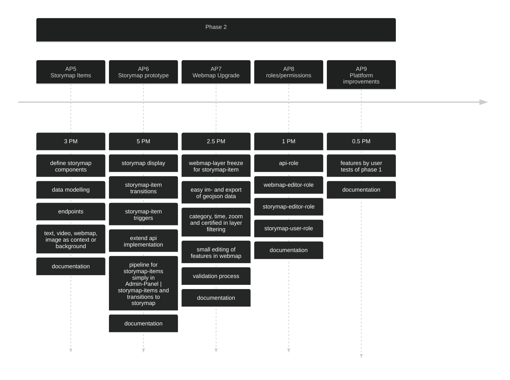
```mermaid
---
config:
  theme: 'dark'
---
timeline
    section Phase 2
    AP5 <br> Storymap Items
    : 3 PM
    : define storymap components
    : data modelling
    : endpoints
    : text, video, webmap, image as context or background
    : documentation
    AP6 <br> Storymap prototype
    : 5 PM
    : storymap display
    : storymap-item transitions
    : storymap-item triggers
    : extend api implementation
    : pipeline for storymap-items simply in Admin-Panel | storymap-items and transitions to storymap
    : documentation
    AP7 <br> Webmap Upgrade
    : 2.5 PM
    : webmap-layer freeze for storymap-item
    : easy im- and export of geojson data
    : category, time, zoom and certified in layer filtering
    : small editing of features in webmap
    : validation process
    : documentation
    AP8 <br> roles/permissions
    : 1 PM
    : api-role
    : webmap-editor-role
    : storymap-editor-role
    : storymap-user-role
    : documentation
    AP9 <br> Plattform improvements
    : 0.5 PM
    : features by user tests of phase 1
    : documentation
```

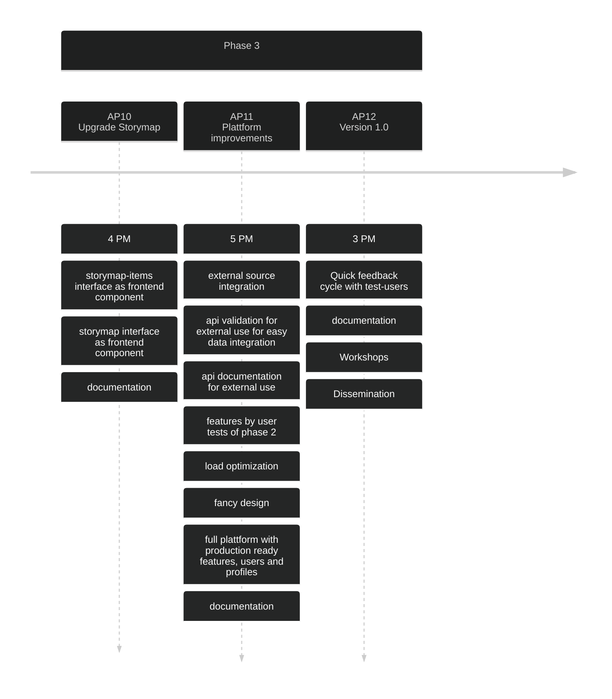
```mermaid
---
config:
  theme: 'dark'
---
timeline
    section Phase 3
    AP10 <br> Upgrade Storymap
    : 4 PM
    : storymap-items interface as frontend component
    : storymap interface as frontend component
    : documentation
    AP11 <br> Plattform improvements
    : 5 PM
    : external source integration
    : api validation for external use for easy data integration
    : api documentation for external use
    : features by user tests of phase 2
    : load optimization
    : fancy design
    : full plattform with production ready features, users and profiles
    : documentation
    AP12 <br> Version 1.0
    : 3 PM
    : Quick feedback cycle with test-users
    : documentation
    : Workshops
    : Dissemination
```

Details to phases: [Phases](#phases)

## Project Plan

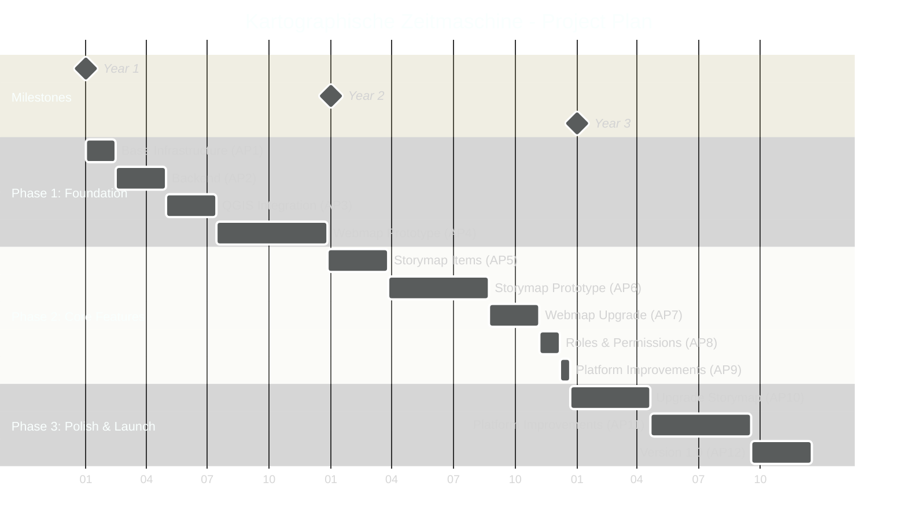
```mermaid
---
config:
  theme: 'dark'
---
gantt
    title Kartographische Zeitmaschine - Project Plan
    todayMarker off
    dateFormat  YYYY-MM-DD
    axisFormat  %m
    
    section Milestones
    Year 1 :milestone, m2025, 2025-01-01, 0d
    Year 2 :milestone, m2026, 2026-01-01, 0d
    Year 3 :milestone, m2027, 2027-01-01, 0d

    section Phase 1: Foundation
    Base Infrastructure (AP1)           :ap1, 2025-01-01, 45d
    Backend (AP2)                       :ap2, after ap1, 75d
    QGIS Integration (AP3)              :ap3, after ap2, 75d
    Webmap Prototype (AP4)              :ap4, after ap3, 165d

    section Phase 2: Core Features
    Storymap Items (AP5)                :ap5, after ap4, 90d
    Storymap Prototype (AP6)            :ap6, after ap5, 150d
    Webmap Upgrade (AP7)                :ap7, after ap6, 75d
    Roles & Permissions (AP8)           :ap8, after ap7, 30d
    Platform Improvements (AP9)         :ap9, after ap8, 15d

    section Phase 3: Polish & Launch
    Upgrade Storymap (AP10)             :ap10, after ap9, 120d
    Platform Improvements (AP11)        :ap11, after ap10, 150d
    Version 1.0 (AP12)                  :ap12, after ap11, 90d
```
---
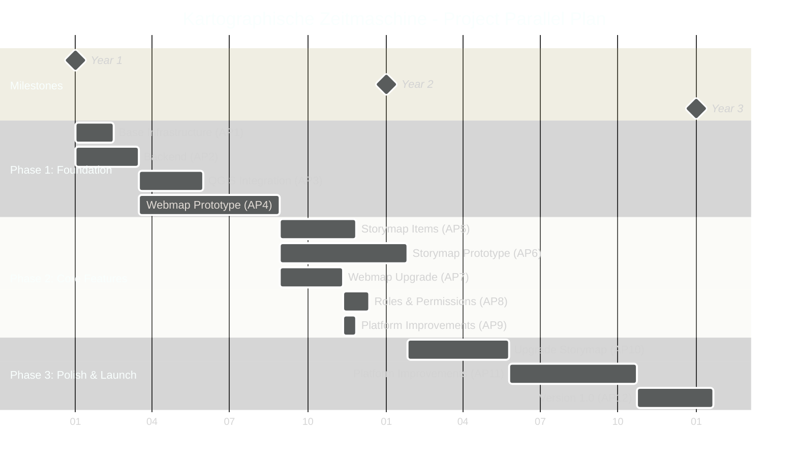
```mermaid
---
config:
  theme: 'dark'
---
gantt
    title Kartographische Zeitmaschine - Project Parallel Plan
    todayMarker off
    dateFormat  YYYY-MM-DD
    axisFormat  %m

    section Milestones
    Year 1 :milestone, m2025, 2025-01-01, 0d
    Year 2 :milestone, m2026, 2026-01-01, 0d
    Year 3 :milestone, m2027, 2027-01-01, 0d

    section Phase 1: Foundation
    Base Infrastructure (AP1)           :ap1, 2025-01-01, 45d
    Backend (AP2)                       :ap2, 2025-01-01, 75d
    QGIS Integration (AP3)              :ap3, after ap2, 75d
    Webmap Prototype (AP4)              :ap4, after ap2, 165d

    section Phase 2: Core Features
    Storymap Items (AP5)                :ap5, after ap4, 90d
    Storymap Prototype (AP6)            :ap6, after ap4, 150d
    Webmap Upgrade (AP7)                :ap7, after ap4, 75d
    Roles & Permissions (AP8)           :ap8, after ap7, 30d
    Platform Improvements (AP9)         :ap9, after ap7, 15d

    section Phase 3: Polish & Launch
    Upgrade Storymap (AP10)             :ap10, after ap6, 120d
    Platform Improvements (AP11)        :ap11, after ap10, 150d
    Version 1.0 (AP12)                  :ap12, after ap11, 90d
```


## Core Components

### Webmap

#### Layer Management
- **Multi-Layer Support**: Web-Map supports up to 30 layers
- **Layer Creation**: Dynamic creation and management of map layers
- **Data Integration**: Adding data and information to layers
- **Layer Controls**: Show/hide layers

#### Styling & Visual Elements
- **Colors**: Individual coloring for different map elements
- **Shapes**: Support for various geometric shapes
- **Styling**: Comprehensive styling options for all map elements

#### Interactive Elements
- **Pop-ups**: Interactive pop-up windows with information
- **Text in Pop-ups**: Detailed text information in pop-up windows
- **Zoom Levels**: Seamless zoom functionality
- **Markers**: Placement and management of markers
- **Legends**: Dynamic map legends
- **Chapter Headings**: Structured chapter navigation

#### Zoom & Visibility Management
- **24 Zoom Levels**: Each zoom level has specific content (map type, fountains, streets, etc.)
- **Point Clustering**: When multiple points overlap, they are combined into a single larger point
- **Feature-Zoom Assignment**: Features are assigned to specific zoom levels
- **Visibility & Transparency**: Dynamic layer visibility
- **Spatial Levels**: Space - City - Street - World
- **Context-dependent Display**: Content changes according to zoom level

#### Map Types & Styles
<!-- - **15 Map Types**: Various map styles available -->
- **Satellite**: Satellite imagery display
- **Historical-grey**: Historical grayscale maps
- **Aerial Photos**: High-resolution aerial photographs
- **Style-Switching**: Dynamic switching between map styles

#### Geodata Support
- **GeoJSON Integration**: Full GeoJSON support
- **Vector Data**: Vector-based map data
- **Geometry Types**: Support for Points, Lines, Polygons


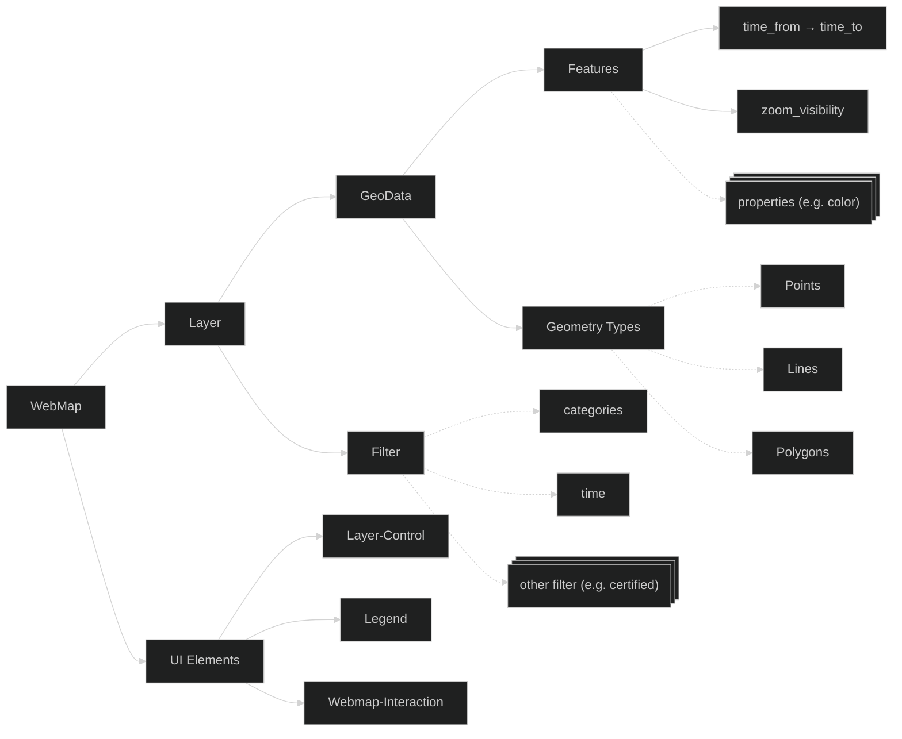
```mermaid
---
config:
  theme: 'dark'
---

graph LR
    %% Core entity relationships
    W[WebMap] --> L[Layer]
    L --> G[GeoData]
    L --> F[Filter]
    G --> FT[Features]
    G --> GT[Geometry Types]
    
    %% Geometry types belong to Feature, not Layer
    GT -.-> P[Points]
    GT -.-> LN[Lines]
    GT -.-> PLY[Polygons]
    
    FT --> TM["time_from → time_to"]
    FT --> ZM["zoom_visibility"]    
    FT -.-> PRP@{ shape: procs, label: "properties (e.g. color)"}

    F -.-> CAT[categories]
    F -.-> T[time]
    F -.-> Z@{ shape: procs, label: "other filter (e.g. certified)"}
    
    W --> U[UI Elements]
    U --> C[Layer-Control]
    U --> LG[Legend]
    U --> I[Webmap-Interaction]
    
    %% Style
    %%classDef entity fill:#555,stroke:#333
    %%classDef geo_json fill:#BBB,stroke:#333,color:#333
    %%classDef interaction fill:#222,stroke:#333,stroke-width:8px,color:#DDD
    %%classDef attributes fill:#222,stroke:#666,stroke-width:1px,stroke-dasharray: 3 3,color:#DDD
    class W,L,U entity
    class G,FT,GT geo_json
    class C,F interaction
    class CAT,T,Z,CRT,CRT_BY,P,LN,PLY,PRP,TM,ZM attributes
```
---

### Storymap

#### Storymap UI
- Best for mobile devices and awesome for desktop
- User is guided through a continuous storymap
- Multiple webmaps with different layers or images
- Triggered by scrolling event
- No information overload (controlled experience)
- User can pause story and interact with current webmap
- Reset interaction with dedicated button

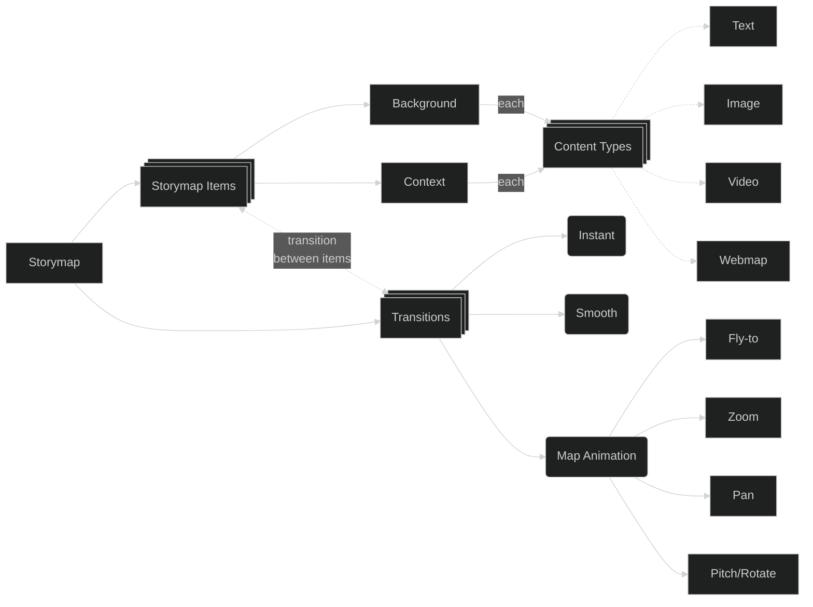
```mermaid
---
config:
  theme: 'dark'
---

graph LR
    A[Storymap] --> B@{ shape: procs, label: "Storymap Items"}
    B --> D[Background]
    B --> C[Context]
    A --> E@{ shape: procs, label: "Transitions"}
    B <-.->|transition<br>between items| E
    
    %% Common Content Types
    CT@{ shape: procs, label: "Content Types"} -.-> F[Text]
    CT -.-> G[Image]
    CT -.-> H[Video]
    CT -.-> I[Webmap]
    
    %% Context and Background use the same content types
    C -->|each| CT
    D -->|each| CT
    
    E --> N(Instant)
    E --> O(Smooth)
    E --> P(Map Animation)
    P --> Q[Fly-to]
    P --> R[Zoom]
    P --> S[Pan]
    P --> T[Pitch/Rotate]
    %%classDef attributes fill:#222,stroke:#666,stroke-width:1px,stroke-dasharray: 3 3,color:#DDD
    %%classDef interaction fill:#222,stroke:#333,stroke-width:4px,color:#DDD
    %%classDef item fill:#BBB,stroke:#333,color:#333
    class F,G,H,I,Q,R,S,T attributes
    class C,D interaction
    class CT item
```
### Editoral Department

Thanks to Django the admin interface is ready to use and can be extended as needed for the editoral department and verification of the data.

### User Roles and Permissions

The platform will support a role-based access control (RBAC) system to manage content creation, data verification, and public access. The following roles are defined:

- **Administrator**:
  - Full control over the system, including user management, system settings, and all content.
  - Can assign roles to other users.
  - Can delete any storymap or dataset.

- **Editor / Author**:
  - Can create, edit, and manage their own storymaps.
  - Can use any data from the "Verified Data Pool" in their storymaps.
  - Can submit their storymaps for editorial review and publication.

- **Data Specialist**:
  - Responsible for uploading, managing, and documenting datasets.
  - Can submit datasets for certification to be included in the "Verified Data Pool."
  - Cannot create or edit storymaps.

- **Public Viewer**:
  - The default role for all visitors.
  - Can browse and view all published storymaps.
  - Cannot access draft content, the editor, or the admin interface.

### Admin Panel & Data Workflow

The backend provides powerful interfaces for data management through the Django Admin Panel and direct QGIS integration. The following mockups illustrate these key, currently available workflows as examples.

**1. Django Admin Data Models**

The admin panel includes views for managing the core data models: `Layer`, `Feature`, and `GeoData`.


*Placeholder | Caption: Admin view showing the list displays for core data models.*

**2. REST Framework API View**

A browsable API endpoint, powered by Django REST Framework, is available for frontend integration.


*Placeholder | Caption: The browsable API view for the GeoData serializer.*

**3. QGIS Data Interaction**

Direct integration with QGIS allows for creating, editing, and managing geospatial data stored in PostGIS.


*Placeholder | Caption: Example of editing a feature layer in QGIS connected to the project's PostGIS database.*

## Core Technology Stack

The Kartografische_Zeitmaschine is built on a modern, scalable technology stack designed for reliability and maintainability.
Our technology choices are guided by core principles of **low-threshold access**, **open standards** and
**networked interoperability** to ensure the platform remains accessible, maintainable, and extensible.

Key considerations in our technology selection:
- **Open Standards & Fair Identifiers**: All components support open standards and persistent identifiers
- **Networked & Interoperable**: Built with APIs and interfaces that enable seamless integration
- **Detailed yet Concise**: Comprehensive documentation with clear, maintainable implementations

Here are the core technologies powering the platform:

### GitHub <https://github.com/>
- **License**: Proprietary (Free for public repositories, paid for private)
- **Open Source**: Partially (Git itself is open source, GitHub is proprietary)
- Free CI/CD with GitHub Actions <https://github.com/features/actions>
- Integrated docs and site hosting

### Terraform <https://www.terraform.io/>
- **License**: Business Source License (BSL) 1.1
- **Open Source**: Yes (with some restrictions)
- Infrastructure as Code (IaC)

### k3s <https://k3s.io/> | <https://docs.k3s.io> | <https://github.com/k3s-io/k3s/>
- K3s is lightweight Kubernetes — more modern, scalable, and better supported than the deprecated Docker Swarm.

Source: [https://docs.docker.com/retired/#swarmkit](https://docs.docker.com/retired/#swarmkit), [https://earthly.dev/blog/k3s-and-k8s/](https://earthly.dev/blog/k3s-and-k8s/)


- Lightweight, self-hosted Kubernetes
- Easy to install and manage
- Fully Kubernetes-compliant, compatible with standard tools
- Built-in support for Traefik, simplifying ingress and networking

### nginx <https://nginx.org/>
- **License**: 2-clause BSD-like license
- **Open Source**: Yes
- Lightweight, high-performance web server with minimal resource usage
- Event-driven architecture for handling high concurrency

### PostgreSQL <https://www.postgresql.org/>
- **License**: PostgreSQL License (free and open-source)
- **Open Source**: Yes
- Robust, scalable, and standards-compliant RDBMS
- Supports a wide range of data types, including geospatial

### GeoDjango <https://docs.djangoproject.com/en/5.2/ref/contrib/gis/>
- **License**: BSD 3-clause (Django's license)
- **Open Source**: Yes
- Comprehensive framework – Combines robust web development with geospatial capabilities
- Rapid development – Django's built-in tools accelerate secure and scalable app creation
- Integrated GIS support – GeoDjango provides spatial queries, geometry fields, and map-enabled admin
- Python-based – Easily extends with geospatial libraries like GDAL, Shapely, and Fiona
- Proven and well-supported – Mature ecosystem with strong documentation and community
- Database flexibility – Supports PostGIS, SpatiaLite, Oracle, and MySQL

### Vue.js <https://vuejs.org/>
- **License**: MIT
- **Open Source**: Yes
- Lightweight with efficient virtual DOM
- Easy to integrate

## Packages & Libraries

### Database
#### Extensions
- **PostGIS** <https://postgis.net/>
    - Open source, MIT-licensed
    - Spatial database extender for PostgreSQL
    - Enables powerful spatial queries and operations
    - Supports a wide range of geospatial data types and operations
    - Fast and efficient, with powerful indexing and querying

### Backend
#### Core Dependencies
- **Django** <https://www.djangoproject.com/>
  - Full-stack Python web framework
  - Built-in admin interface, ORM, and security features
  - Chosen for rapid development and robustness

#### Geospatial
- **GeoDjango** <https://docs.djangoproject.com/en/5.2/ref/contrib/gis/>
  - Django's geographic web framework
  - Spatial database extensions and utilities
  - Seamless integration with Django ORM

##### _Spatial Database Support_
Docs on supported backends (PostGIS, SpatiaLite, etc.):
<https://docs.djangoproject.com/en/stable/ref/contrib/gis/db-api/#backend-support>

##### _Geometry Fields and ORM Lookups_
Docs on spatial fields (PointField, PolygonField, etc.) and lookups like contains, intersects, distance_lt:
<https://docs.djangoproject.com/en/stable/ref/contrib/gis/model-api/>
<https://docs.djangoproject.com/en/stable/ref/contrib/gis/db-api/#spatial-lookups>

##### _Geometry Operations_
Docs on geometry functions (area, length, transform, etc.):
<https://docs.djangoproject.com/en/stable/ref/contrib/gis/geos/>
<https://docs.djangoproject.com/en/stable/ref/contrib/gis/functions/>

##### _Import/Export GIS Data_
Using LayerMapping and ogrinspect:
<https://docs.djangoproject.com/en/stable/ref/contrib/gis/layermapping/>
<https://docs.djangoproject.com/en/stable/ref/contrib/gis/ogrinspect/>

##### _GIS Library Integration_
GeoDjango uses GEOS, GDAL, and PROJ. Setup instructions:
<https://docs.djangoproject.com/en/stable/ref/contrib/gis/install/#geodjango-installation>

##### _Admin Map Interface_
Docs on how map widgets appear in the Django admin for spatial fields:
<https://docs.djangoproject.com/en/stable/ref/contrib/gis/admin/>


### Frontend
#### Core Framework
- **Vue.js** <https://vuejs.org/guide/typescript/overview.html>
  - Progressive JavaScript/TypeScript framework
  - First-class TypeScript support with type inference
  - Enhanced code quality and developer experience
  - Better IDE support and autocompletion
  - Early error detection during development
  - Improved code maintainability and scalability

#### Development Tools
- **TypeScript** <https://www.typescriptlang.org/>
  - Strictly typed superset of JavaScript
  - Compiles to clean, readable JavaScript
  - Enhanced code quality and maintainability
  - Better tooling and IDE support
  - Gradual adoption path for existing JavaScript code

#### Mapping & Visualization
- **MapLibre GL JS** <https://MapLibre.org/MapLibre-gl-js/>
  - Open-source mapping library
  - Vector tile rendering
  - Smooth animations and interactions
  - Why Use MapLibre GL JS Over Leaflet?
    - Vector-based rendering – Smoother, higher-quality maps with better performance, especially for large datasets.
    - 3D capabilities – Supports 3D terrain and building rendering, unlike Leaflet.
    - Faster performance – WebGL rendering provides real-time performance with vector tiles.
    - Advanced styling – More control over map features and dynamic styling.
    - Custom vector tiles – Greater flexibility with custom data and styles.

#### UI Components

UI Component Options:
- Vuetify: Material Design components
- Tailwind CSS: Utility-first CSS framework
- Quasar: Cross-platform components
- Element Plus: Minimalist Vue 3 components
- PrimeVue: Enterprise-grade components

## Phases

Main parts in development are Frontend, Backend, Database and QGIS as an editor for spatial data.

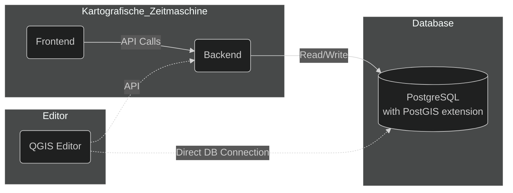
```mermaid
---
config:
  theme: 'dark'
---

graph LR
    subgraph Kartografische_Zeitmaschine
        vue(Frontend) -->|API Calls| dj(Backend)
    end
    subgraph Database
        dj -->|Read/Write| db[(PostgreSQL<br/>with PostGIS extension)]
    end
    
    subgraph Editor
        Q(QGIS Editor) -.->|API| dj
        Q -.->|Direct DB Connection| db
    end
    
    
    %%style Q fill:#1d2b4c,stroke:#335,stroke-width:2px
    %%style dj stroke:#335,stroke-width:2px,color:white
    %%style db stroke:#335,stroke-width:2px,color:white
    %%style vue stroke:#335,stroke-width:2px,color:white

```

### Phase 1: Foundation
Establishes the core infrastructure and basic functionality, including authentication, map viewing, and QGIS integration.

#### MVP
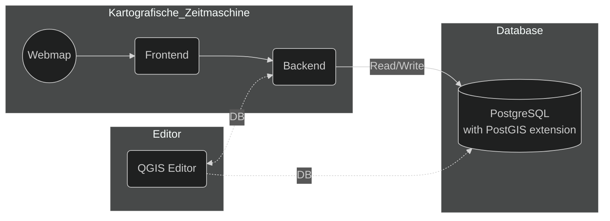
```mermaid
---
config:
  theme: 'dark'
---
graph LR
    subgraph Kartografische_Zeitmaschine
        webmap((Webmap)) -->vue(Frontend)
        vue(Frontend) --> dj(Backend)
    end
    subgraph Database
        dj -->|Read/Write| db[(PostgreSQL<br/>with PostGIS extension)]
    end
    
    subgraph Editor
        Q(QGIS Editor) -.->|DB| db
        Q(QGIS Editor) <-.->|DB| dj
    end
    
    
    %%style Q fill:#1d2b4c,stroke:#335,stroke-width:2px
    %%style dj stroke:#335,stroke-width:2px,color:white
    %%style db stroke:#335,stroke-width:2px,color:white
    %%style vue stroke:#335,stroke-width:2px,color:white
```
---

#### Detailed View
The detailed view shows the core components of the MVP.
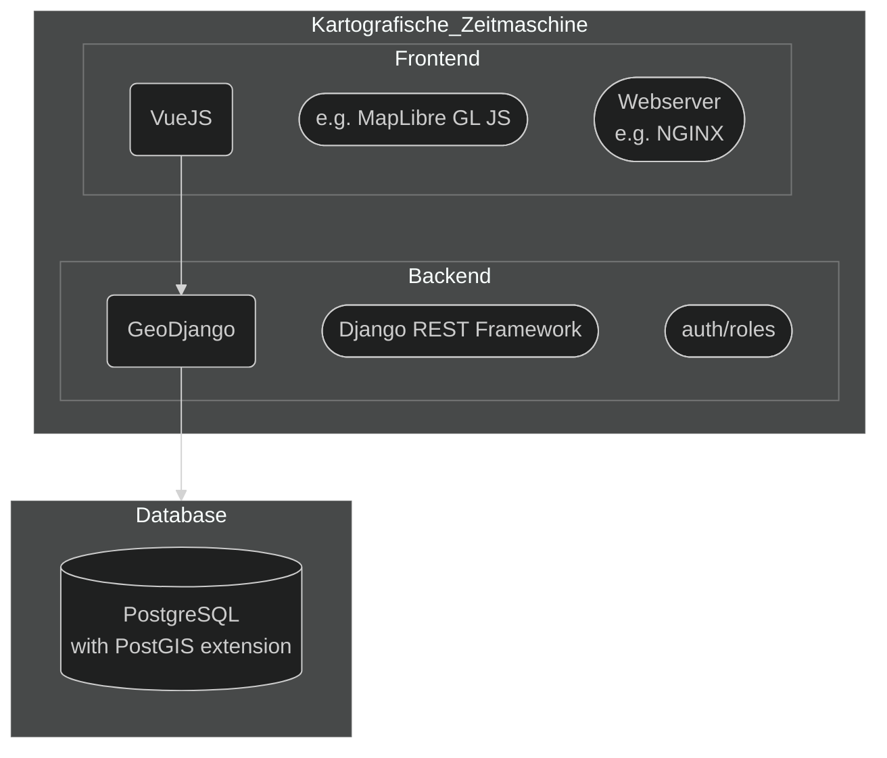
```mermaid
---
config:
  theme: 'dark'
---

graph TD
    subgraph Kartografische_Zeitmaschine
        vue(Frontend) --> dj(Backend)
        subgraph Frontend
            vue(VueJS)
            ml([e.g. MapLibre GL JS])
            nginx([Webserver<br/>e.g. NGINX])
        end
        subgraph Backend
            dj(GeoDjango)
            drf([Django REST Framework])
            auth([auth/roles])
        end
    end
    subgraph Database
        db[(PostgreSQL<br/>with PostGIS extension)]
    end
    
    dj --> Database

    %%style dj stroke:#335,stroke-width:2px,color:white
    %%style db stroke:#335,stroke-width:2px,color:white
    %%style vue stroke:#335,stroke-width:2px,color:white

```
---

#### Cluster Setup

The MVP will be in a cluster like shown in the diagram below.

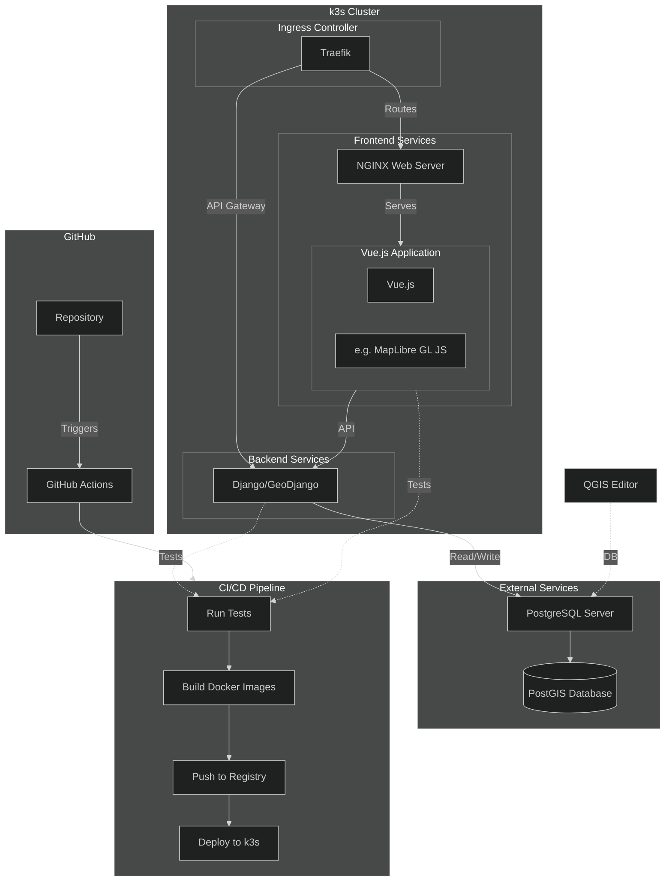
```mermaid
---
config:
  theme: 'dark'
---

graph TD
    subgraph GitHub[GitHub]
        Repo[Repository]
        Actions[GitHub Actions]
        Repo -->|Triggers| Actions
    end
    
    subgraph K3s_Cluster[k3s Cluster]
        subgraph Ingress[Ingress Controller]
            traefik[Traefik]
        end
        
        subgraph Frontend[Frontend Services]
            subgraph WebApp[Vue.js Application]
                direction LR
                Vue[Vue.js]
                MapLibre[e.g. MapLibre GL JS]
            end
            Nginx[NGINX Web Server]
            Nginx -->|Serves| WebApp
        end
        
        subgraph Backend[Backend Services]
            Django[Django/GeoDjango]
        end
        
        traefik -->|Routes| Nginx
        traefik -->|API Gateway| Django
    end
    
    subgraph External[External Services]
        PgServer[PostgreSQL Server] --> PgDB[(PostGIS Database)]
        %%style PgServer stroke:#335,stroke-width:2px,color:white
        %%style PgDB stroke:#335,stroke-width:2px,color:white
    end
    
    QGIS[QGIS Editor]
    
    %% Application Connections
    WebApp -- API --> Django
    Django -->|Read/Write| PgServer
    QGIS -.->|DB| PgServer
    
    %% CI/CD Pipeline
    subgraph CI_CD[CI/CD Pipeline]
        direction LR
        Tests[Run Tests] --> Build[Build Docker Images] --> Push[Push to Registry] --> Deploy[Deploy to k3s]
    end
    
    %% Connections
    Actions --> CI_CD
    Django & WebApp -.->|Tests| Tests
    
    %% Styling
    %%style QGIS fill:#1d2b4c,stroke:#335,stroke-width:2px,color:white
    %%style Django stroke:#335,stroke-width:2px,color:white
    %%style WebApp stroke:#335,stroke-width:2px,color:white
    %%style GitHub fill:#24292f,stroke:#57606a,stroke-width:2px,color:white
    %%style Actions fill:#2088ff,stroke:#1a5f99,stroke-width:2px,color:white
```
---

Minimal graph showing the core components of cluster.

The cluster part should be duplicated for TST and the TST database might be on the same node as the PRD database.

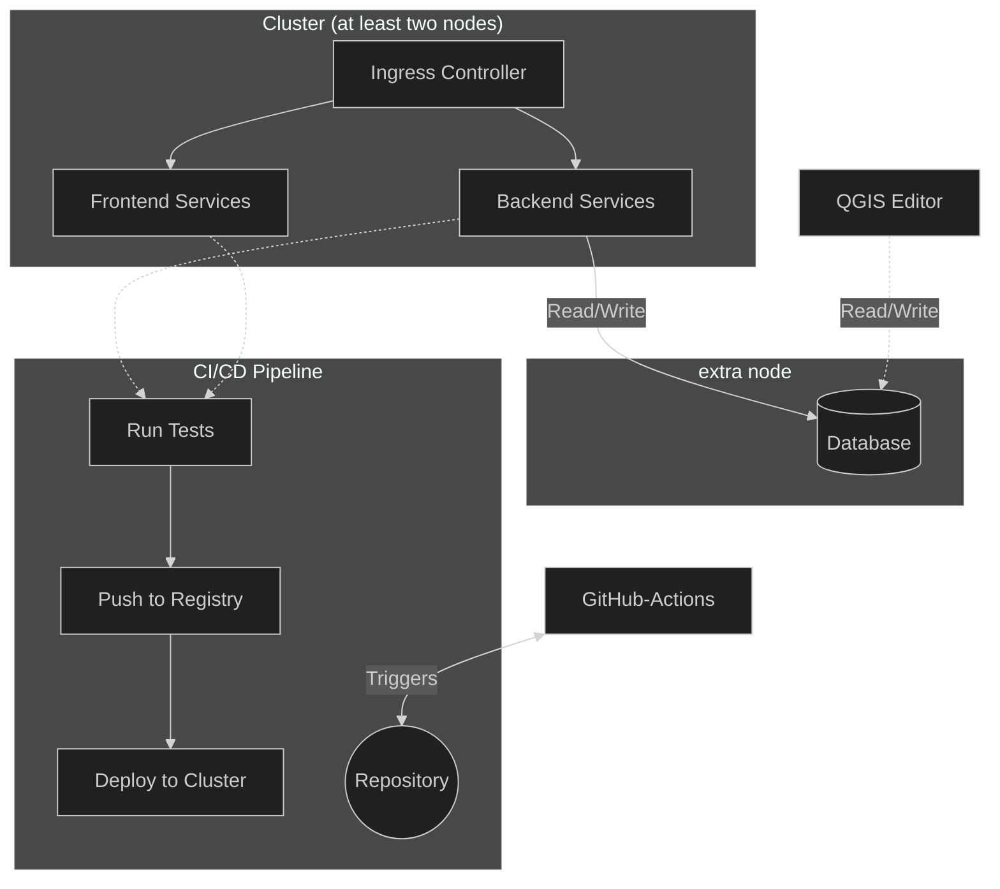
```mermaid
---
config:
  theme: 'dark'
---

graph TD
    subgraph Cluster["Cluster (at least two nodes)"]
            Ingress[Ingress Controller]
            Frontend[Frontend Services]
            Backend[Backend Services]
            Ingress --> Frontend
            Ingress --> Backend
        %%style Backend stroke:#335,stroke-width:2px,color:white
        %%style Frontend stroke:#335,stroke-width:2px,color:white
    end
    subgraph Data_Layer[extra node]
        Database[(Database)]
        %%style Database stroke:#335,stroke-width:2px,color:white
    end
    
    QGIS[QGIS Editor]
    
    %% Application Connections
    Backend -->|Read/Write| Database
    QGIS -.->|Read/Write| Database
    
    %% CI/CD Pipeline
    subgraph CI_CD[CI/CD Pipeline]
        direction LR
        Tests[Run Tests] --> Push[Push to Registry] --> Deploy[Deploy to Cluster]
        Repo((Repository))
    end
    
    %% Connections
    GitHub-Actions <-->|Triggers| Repo
    Backend & Frontend -.-> Tests
```
---
Cleaner version with same content as graph above.
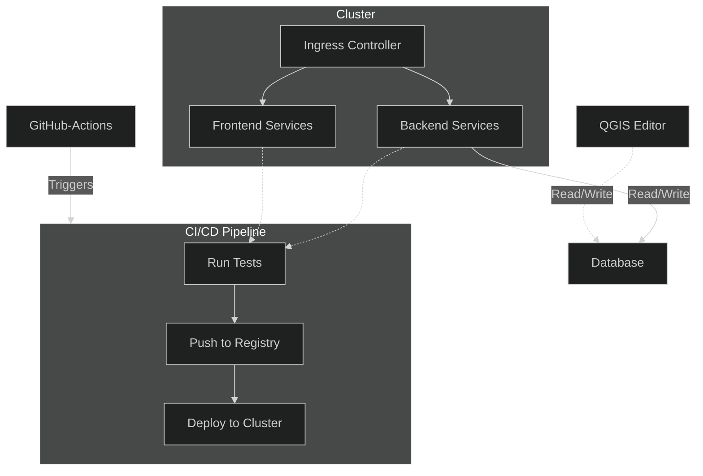
```mermaid
---
config:
  theme: 'dark'
---

graph TD
    subgraph Cluster[Cluster]
        Ingress[Ingress Controller]
        Frontend[Frontend Services]
        Backend[Backend Services]
        Ingress --> Frontend
        Ingress --> Backend
    end
        Database[Database]
    
    QGIS[QGIS Editor]
    
    %% Application Connections
    Backend -->|Read/Write| Database
    QGIS -.->|Read/Write| Database
    
    %% CI/CD Pipeline
    subgraph CI_CD[CI/CD Pipeline]
        direction LR
        Tests[Run Tests] --> Push[Push to Registry] --> Deploy[Deploy to Cluster]
    end
    
    %% Connections
    GitHub-Actions -->|Triggers| CI_CD
    Backend & Frontend -.-> Tests
```


### Phase 2: Expansion
Builds on the MVP with advanced features like storymaps, enhanced roles, and platform improvements based on user feedback.

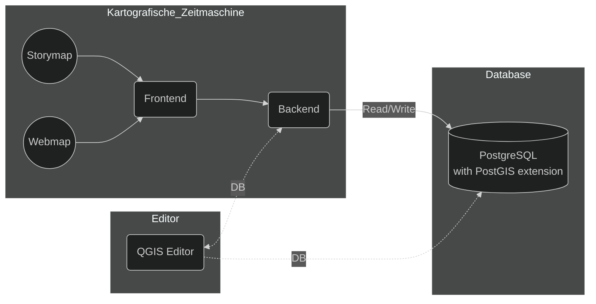
```mermaid
---
config:
  theme: 'dark'
---

graph LR
    subgraph Kartografische_Zeitmaschine
        storymap((Storymap)) -->vue(Frontend)
        webmap((Webmap)) -->vue(Frontend)
        vue(Frontend) --> dj(Backend)
    end
    subgraph Database
        dj -->|Read/Write| db[(PostgreSQL<br/>with PostGIS extension)]
    end
    
    subgraph Editor
        Q(QGIS Editor) -.->|DB| db
        Q(QGIS Editor) <-.->|DB| dj
    end
    
    
    %%style Q fill:#1d2b4c,stroke:#335,stroke-width:2px
    %%style dj stroke:#335,stroke-width:2px,color:white
    %%style db stroke:#335,stroke-width:2px,color:white
    %%style vue stroke:#335,stroke-width:2px,color:white
```

### Phase 3: Maturity
Focuses on refinement, user experience, and community engagement and api documentation to prepare for the 1.0 release.
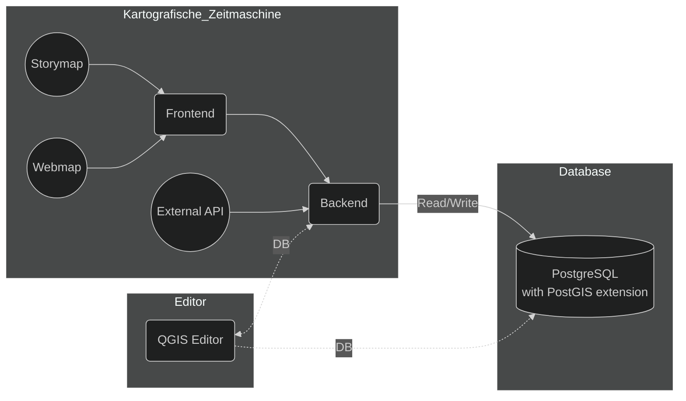
```mermaid
---
config:
  theme: 'dark'
---

graph LR
    subgraph Kartografische_Zeitmaschine
        storymap((Storymap)) -->vue(Frontend)
        webmap((Webmap)) -->vue(Frontend)
        vue(Frontend) --> dj(Backend)
        api((External API)) --> dj(Backend)
    end
    subgraph Database
        dj -->|Read/Write| db[(PostgreSQL<br/>with PostGIS extension)]
    end
    
    subgraph Editor
        Q(QGIS Editor) -.->|DB| db
        Q(QGIS Editor) <-.->|DB| dj
    end
    
    
    %%style Q fill:#1d2b4c,stroke:#335,stroke-width:2px
    %%style dj stroke:#335,stroke-width:2px,color:white
    %%style db stroke:#335,stroke-width:2px,color:white
    %%style vue stroke:#335,stroke-width:2px,color:white
```

## Webmap Components

| Component | Property | Description | "Esri-like" Requirement |
| :--- | :--- | :--- | :--- |
| **Basemap** | **Source** | The URL or service providing the base map tiles. | High-quality, visually neutral basemap (e.g., light gray canvas, satellite, topographic) that doesn't distract from your data. |
| | **Projection** | The coordinate system used (usually Web Mercator). | Consistent projection across all layers to ensure alignment. |
| **Layers** | **Source Data** | The geographic data to be displayed. | Clean, optimized data. Common formats: **GeoJSON** (for simplicity), **Vector Tiles (MVT)** (for performance with large datasets). |
| | **Visibility** | Whether the layer is currently visible or not. | Can be toggled on/off by the user via a layer list control. |
| | **Opacity** | The transparency level of the entire layer (0-1). | Used for blending layers or de-emphasizing less important data. |
| | **Zoom Range** | The zoom levels at which the layer is visible. | **Crucial for performance and clarity.** Show detailed layers only when zoomed in to avoid clutter. |
| **Feature Styling**| | | |
| ├ **Points** | `icon-image` | A custom image or symbol to represent the point. | High-quality, meaningful SVG icons. |
| | `icon-size` | The size of the icon. | Can be driven by data (e.g., bigger icon for a bigger city). |
| | `text-field` | An attribute to display as a label next to the point. | Clear, legible font with a halo effect for readability against any background. |
| ├ **Lines** | `line-color` | The color of the line. | Colors are often data-driven (e.g., red for highways, blue for rivers). |
| | `line-width` | The thickness of the line. | Can be used to show importance (e.g., thicker line for a major road). |
| | `line-dasharray`| Creates dashed or dotted lines. | Useful for representing proposed routes, boundaries, or different statuses. |
| ├ **Polygons**| `fill-color` | The color of the area inside the polygon. | **Data-driven choropleth maps** are a hallmark (e.g., coloring states by population). |
| | `fill-opacity` | The transparency of the fill color. | Allows underlying features or basemaps to be visible. |
| | `outline-color`| The color of the polygon's border. | A subtle, clean border to clearly define the shape. |
| **Popups** | **Content** | The HTML content to display when a feature is clicked. | Rich content: not just text, but **images, charts, and links**. Use attribute placeholders like `{name}` or `{population}`. |
| | **Trigger** | The event that opens the popup. | Typically `on-click`. Hover-triggered tooltips are also common for quick info. |
| | **Styling** | CSS to control the look of the popup container. | Clean, modern design that matches the overall UI of the application. |
| **Interactivity** | **Map Controls** | UI elements for navigation. | Standard controls: Zoom In/Out, Compass (Reset North), Geolocation (Find My Location), Scale Bar. |
| | **Legend** | A key that explains the map's symbols and colors. | **Essential for complex maps.** A legend makes your map readable and professional. |
| | **Animations** | Smooth transitions when the map view changes. | Use of `flyTo` or `easeTo` animations instead of instantly jumping to a new location. |

### Summary for an "Esri-like" Feel:
To get that professional, polished look similar to Esri's StoryMaps, the key is to move beyond just displaying data and focus on **data-driven visualization** and a **rich user experience**.

1.  **Performance is Key**: Use **Vector Tiles** for large datasets. Nothing looks less professional than a slow, laggy map.
2.  **Styling with Purpose**: Don't just pick random colors. Use color and size to tell a story about your data. Implement a **legend** so users can understand it.
3.  **Rich, Interactive Popups**: Go beyond plain text. Embed images, charts, and formatted text to provide deep context when a user interacts with a feature.
4.  **Smoothness and Polish**: Use animated transitions (`flyTo`) and control layer visibility based on zoom levels to create a seamless, uncluttered experience.

---
### Webmap Components Graph
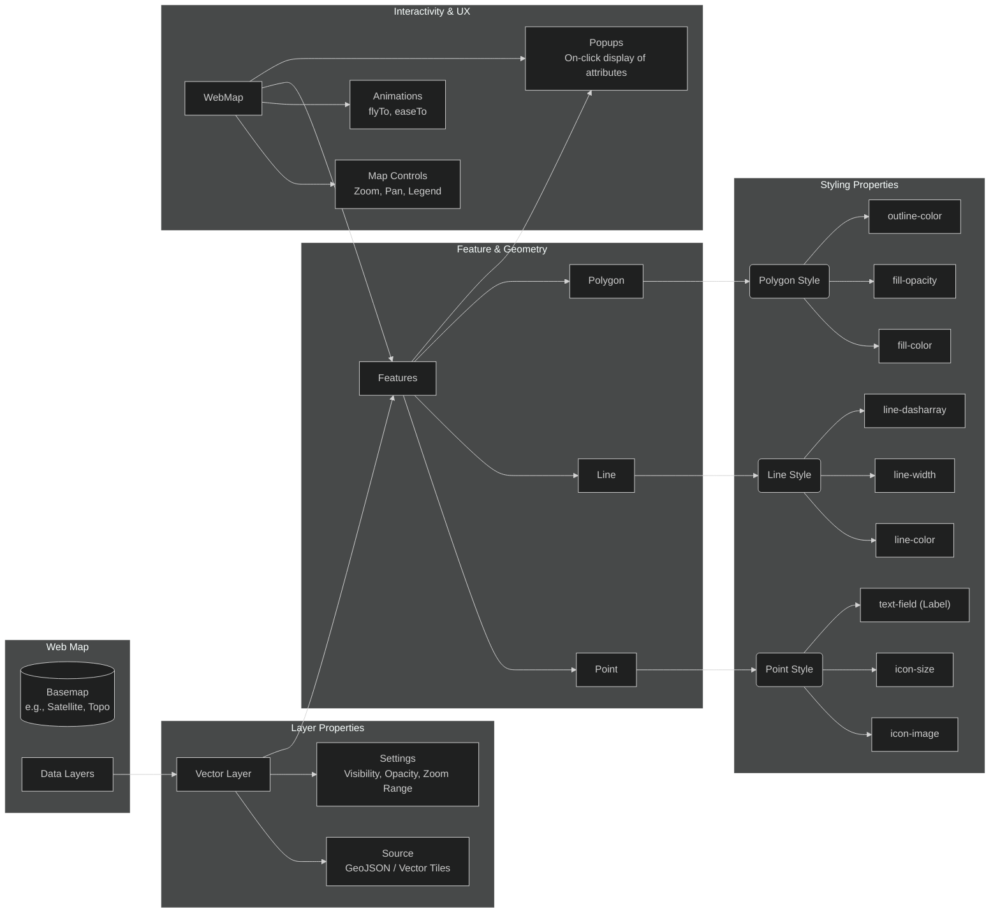
```mermaid
---
config:
  theme: 'dark'
---

graph LR
    subgraph "Web Map"
        direction LR
        Basemap[("Basemap<br>e.g., Satellite, Topo")]
        Layers[Data Layers]
    end

    subgraph "Layer Properties"
        Layers --> VectorLayer[Vector Layer]
        VectorLayer --> Source["Source<br>GeoJSON / Vector Tiles"]
        VectorLayer --> Settings["Settings<br>Visibility, Opacity, Zoom Range"]
    end

    subgraph "Feature & Geometry"
        VectorLayer --> Features
        Features --> Point
        Features --> Line
        Features --> Polygon
    end

    subgraph "Styling Properties"
        Point --> PointStyles("Point Style")
        PointStyles --> P1["icon-image"]
        PointStyles --> P2["icon-size"]
        PointStyles --> P3["text-field (Label)"]

        Line --> LineStyles("Line Style")
        LineStyles --> L1["line-color"]
        LineStyles --> L2["line-width"]
        LineStyles --> L3["line-dasharray"]

        Polygon --> PolygonStyles("Polygon Style")
        PolygonStyles --> Poly1["fill-color"]
        PolygonStyles --> Poly2["fill-opacity"]
        PolygonStyles --> Poly3["outline-color"]
    end

    subgraph "Interactivity & UX"
        Features --> Popups["Popups<br>On-click display of attributes"]
        WebMap --> Controls["Map Controls<br>Zoom, Pan, Legend"]
        WebMap --> Animations["Animations<br>flyTo, easeTo"]
        WebMap --> Features
        WebMap --> Popups
    end
```
## Storymap Components

| Component | Property | Description | "Esri-like" Requirement |
| :--- | :--- | :--- | :--- |
| **Story (Overall)** | `Title` / `Cover` | The main title, subtitle, and cover image/video. | A compelling, high-impact opening that grabs the reader's attention. |
| | `Theme` | Overall visual design (fonts, colors, layout styles). | A consistent, professional, and readable design that enhances the story's mood. |
| **Story Items (Chapters/Slides)** | `Sequence` | The linear or non-linear order of the story's sections. | A logical and engaging narrative flow. |
| | `Layout` | How content is arranged on the screen for each item. | Varied layouts (e.g., floating panel over map, side-by-side, full-screen text) to maintain visual interest. |
| **Content Blocks** | `Type` | The kind of content within a story item. | A rich mix of **Text**, **Images**, **Video**, and embedded content to create a multimedia experience. |
| | `Content` | The actual text, media URLs, or embed codes. | High-quality, optimized media. Well-written, concise prose. |
| **Map Interaction (Scrollytelling)** | `Map View` | The specific map `center`, `zoom`, `pitch`, and `bearing` for a story item. | The map view must perfectly frame the geographic context for that part of the story. |
| | `Active Layers`| Defines which map layers are visible for a specific story item. | Only show layers relevant to the current narrative point to reduce clutter and focus attention. |
| | `Transition` | The animation used to move between map views as the user scrolls. | Smooth `flyTo` or `easeTo` animations that guide the user's focus, creating a cinematic feel. |
| | `Highlighting` | Programmatically emphasizing specific features on the map. | Draws the user's eye to the exact feature being discussed in the text, often by changing its style or adding a marker. |
| **UI/UX** | `Navigation` | How users move through the story. | Clear UI for navigation: a progress bar, chapter headings, and next/previous controls. |
| | `Credits` | A dedicated section to credit data sources, authors, etc. | Proper attribution is crucial for professional and ethical storytelling. |
| | `Sharing` | Options to share the storymap on social media or get a direct link. | Easy sharing encourages wider distribution and impact. |


## Modelling

The models are defined in the `BE` repository as part of the Django project.

### The models are structured as follows:

- `Layer`
- `GeoData`
- `Feature`
- `Webmap`
- `StorymapItem`
- `Storymap`
- `User`
- `Profile`
- `Tag`
- `Group`
- `Category`
- (`IndexContent` / `PageContent` etc.)


### ER Diagram
The ER diagram displays the relationships between the models in the Kartographische_Zeitmaschine. It shows how users are associated with profiles, storymaps, and webmaps. It also shows how storymaps are composed of storymap items, and how webmaps are linked to layers and geodata.


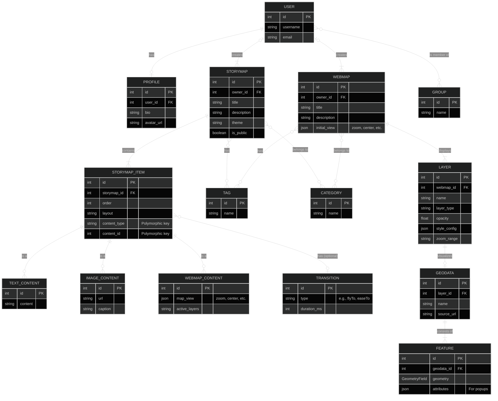
```mermaid
---
config:
  theme: 'dark'
---

erDiagram
    %% --- Cardinality Legend ---
    %% ||--o|  One-to-One
    %% |o--|{  One-to-Many
    %% }o--o{  Many-to-Many

    USER ||--o| PROFILE : "has"
    USER |o--|{ STORYMAP : "creates"
    USER |o--|{ WEBMAP : "creates"
    USER }o--o{ GROUP : "is member of"

    STORYMAP ||--|{ STORYMAP_ITEM : "contains"
    STORYMAP }o--o{ TAG : "has"
    STORYMAP }o--o{ CATEGORY : "belongs to"

    %% A Storymap Item is a polymorphic container for different content types.
    STORYMAP_ITEM ||--o{ TEXT_CONTENT : "is a"
    STORYMAP_ITEM ||--o{ IMAGE_CONTENT : "is a"
    STORYMAP_ITEM ||--o{ WEBMAP_CONTENT : "is a"
    STORYMAP_ITEM }o--o| TRANSITION : "has (optional)"

    WEBMAP ||--|{ LAYER : "displays"
    WEBMAP }o--o{ TAG : "has"
    WEBMAP }o--o{ CATEGORY : "belongs to"

    LAYER ||--o| GEODATA : "visualizes"
    GEODATA ||--|{ FEATURE : "consists of"

    USER {
        int id PK
        string username
        string email
    }

    PROFILE {
        int id PK
        int user_id FK
        string bio
        string avatar_url
    }

    STORYMAP {
        int id PK
        int owner_id FK
        string title
        string description
        string theme
        boolean is_public
    }

    STORYMAP_ITEM {
        int id PK
        int storymap_id FK
        int order
        string layout
        string content_type "Polymorphic key"
        int content_id "Polymorphic key"
    }

    TEXT_CONTENT {
        int id PK
        string content
    }

    IMAGE_CONTENT {
        int id PK
        string url
        string caption
    }

    WEBMAP_CONTENT {
        int id PK
        json map_view "zoom, center, etc."
        string active_layers
    }

    TRANSITION {
        int id PK
        string type "e.g., flyTo, easeTo"
        int duration_ms
    }

    WEBMAP {
        int id PK
        int owner_id FK
        string title
        string description
        json initial_view "zoom, center, etc."
    }

    LAYER {
        int id PK
        int webmap_id FK
        string name
        string layer_type
        float opacity
        json style_config
        string zoom_range
    }

    GEODATA {
        int id PK
        int layer_id FK
        string name
        string source_url
    }

    FEATURE {
        int id PK
        int geodata_id FK
        GeometryField geometry
        json attributes "For popups"
    }

    GROUP {
        int id PK
        string name
    }

    TAG {
        int id PK
        string name
    }

    CATEGORY {
        int id PK
        string name
    }
```
## Repository

The small number of developers and the full stack knowledge of those will lead to a monorepo.

```
Kartographische_Zeitmaschine/
├── .github/workflows/          # CI/CD for deploys/tests
├── apps/
│   ├── frontend/               # Vue.js app (Vite or Nuxt)
│   └── backend/                # GeoDjango app
├── infra/
│   ├── terraform/              # Infra provisioning: K3s cluster, DNS, storage
│   ├── helm/                   # Helm charts for frontend/backend
│   └── scripts/                # Bash and Python utility scripts
├── k8s-manifests/              # Optional: Kustomize or plain manifests
├── docs/
│   ├── architecture.md         # Detailed architecture overview
│   ├── setup.md                # More detailed setup instructions
│   ├── design.md               # Design decisions or high-level explanations
│   └── qgis-integration.md     # Documentation for QGIS integration
├── docker-compose.yml          # Docker compose for local development
└── README.md
```

<!-- ### `.github/workflows/`
Contains GitHub Actions workflows for CI/CD pipelines. This includes:
- Automated testing on pull requests
- Deployment workflows for different environments (TST/PRD)
- Scheduled tasks and maintenance jobs

### `apps/`
Holds the main application code separated into frontend and backend:
- `frontend/`: Vue.js application with Vite or Nuxt.js
  - Components, views, and state management
  - Map visualization using MapLibre GL JS
  - API client for backend communication

- `backend/`: GeoDjango application
  - REST API endpoints
  - Data models with PostGIS integration
  - Authentication and authorization logic
  - Business logic and data processing

### `infra/`
Infrastructure as Code (IaC) and deployment configurations:
- `terraform/`: Infrastructure provisioning
  - k3s cluster setup
  - DNS and networking configuration
  - Storage and database provisioning

- `helm/`: Kubernetes package management
  - Application deployment charts
  - Environment-specific configurations
  - Dependency management

- `scripts/`: Utility scripts
  - Database backup/restore
  - Environment setup helpers
  - Development tools

### `k8s-manifests/`
Kubernetes resource definitions (additional to Helm):
- Deployment configurations
- Service definitions
- Ingress rules
- ConfigMaps and Secrets

### `docs/`
Project documentation:
- `architecture.md`: System architecture and design decisions
- `setup.md`: Local development environment setup
- `design.md`: UI/UX design guidelines and components
- `qgis-integration.md`: QGIS plugin development and integration

### Root Level Files
- `docker-compose.yml`: Local development environment
  - Service definitions for all components
  - Development database setup
  - Volume mounts for hot-reloading

- `README.md`: Project overview and getting started guide
  - Quick start instructions
  - Development workflow
  - Contribution guidelines -->

## Workflow

- CI/CD in beta (direct deployment) with no overflow to production and user tests on the fly
- Workflow vs. Prio-Tickets
    - Prio-Tickets are bugs in production
    - Workflow is for new features that also can have priorities

### Development Workflow

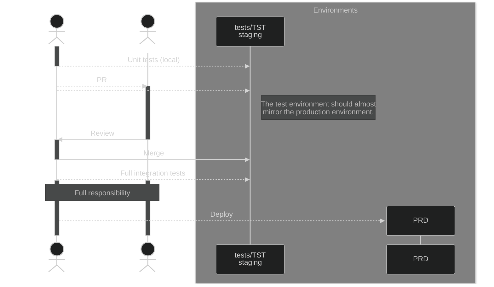
```mermaid
---
config:
  theme: 'dark'
---

sequenceDiagram
    create actor S as 
    create actor M as 
    create participant T as tests/TST<br>staging
    activate S
    S-->>T: Unit tests (local)
    deactivate S
    S-->>M: PR
    activate M
    S-->>T: 
    Note right of T: The test environment should almost<br>mirror the production environment.
    M->>S: Review
    deactivate M
    activate S
    S->>T: Merge
    deactivate S
    S-->>T: Full integration tests 
    activate M
    activate S
    Note over S,M: Full responsibility
    create participant P as PRD
    box GREY Environments
        participant T
        participant P
    end
    S-->>P: Deploy
    deactivate S
    deactivate M

```

Review has focus on tests, code quality and documentation.

After merging to `main` it will be deployed to **TST** and **PRD** via GitHub actions.

### Deployment Workflow

This diagram illustrates the CI/CD pipeline from code push to production deployment, triggered by merges and tags.

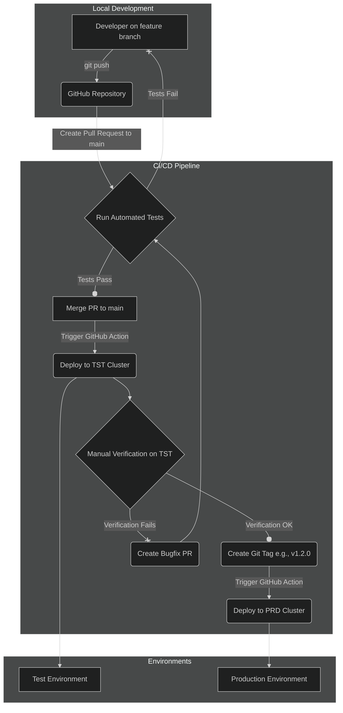
```mermaid
---
config:
  theme: 'dark'
---

graph TD
    subgraph "Local Development"
        A[Developer on feature branch] -->|git push| B(GitHub Repository)
    end

    subgraph "CI/CD Pipeline"
        B -->|Create Pull Request to main| C{Run Automated Tests}
        C --o|Tests Pass| D[Merge PR to main]
        C --x|Tests Fail| A
        
        D -->|Trigger GitHub Action| E(Deploy to TST Cluster)
        E --> F{Manual Verification on TST}
        
        F --o|Verification OK| G(Create Git Tag e.g., v1.2.0)
        F --x|Verification Fails| H(Create Bugfix PR)
        H --> C

        G -->|Trigger GitHub Action| I(Deploy to PRD Cluster)
    end

    subgraph "Environments"
        E --> TST[Test Environment]
        I --> PRD[Production Environment]
    end

    %% Styling to match the document's theme
    %%classDef dev fill:#1d2b4c,stroke:#335,stroke-width:2px,color:white
    %%classDef pipeline fill:#555,stroke:#333,color:white
    %%classDef env fill:#444,stroke:#333,color:white

    class A,H dev
    class B,C,D,E,F,G,I pipeline
    class TST,PRD env
```

### Data Certification and Storytelling Workflow

This workflow ensures data quality and narrative coherence before publication. It's a two-phase process involving data certification followed by storymap creation and review.

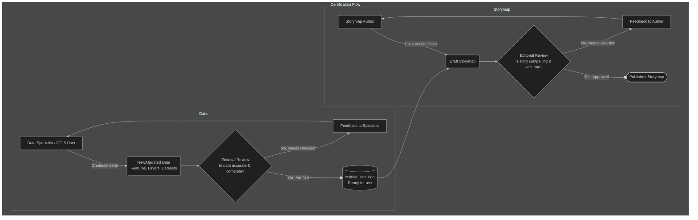
```mermaid
---
config:
  theme: 'dark'
---

flowchart 
subgraph "Certification Flow"
    subgraph "Data"
        A[Data Specialist / QGIS User] -->|Creates/Inserts| B(New/Updated Data<br>Features, Layers, Datasets)
        B --> C{Editorial Review<br>Is data accurate & complete?}
        C --o|Yes, Verified| D[(Verified Data Pool<br>Ready for use)]
        C --x|No, Needs Revision| E[Feedback to Specialist]
        E --> A
    end

    subgraph "Storymap"
        F[Storymap Author] -->|Uses Verified Data| G(Draft Storymap)
        D --> G
        G --> H{Editorial Review<br>Is story compelling & accurate?}
        H --o|Yes, Approved| I([Published Storymap])
        H --x|No, Needs Revision| J[Feedback to Author]
        J --> F
    end
end
```


---
<p align="center">FIN</p>

---
---

## Analysis of Existing Map-Based Projects

The following projects serve as technical or conceptual references. While they are powerful data visualization tools, they generally lack the guided, narrative-driven approach of a storymap.

### <https://martinbrake.de/timelines/autobahn>

This page presents an interactive "timemap" visualizing the historical development of the German Autobahn network.

- **Functionality**: It uses a timeline slider to show the growth of the road network over different years. As the user moves the slider, corresponding road sections are added to the map.
- **Interactivity**: The map is the central element, showing the geographic changes directly. It's a data-driven exploration rather than a guided narrative.
- **Technology**: Built with Leaflet.js for mapping and uses `perfect-scrollbar` for the timeline navigation.

### <https://www.geopedia.de/?m=0&lat=52.51640040808201&lon=13.377404808998108&l=en&z=15>

This website functions as a geographical encyclopedia, displaying Wikipedia articles as interactive points on a map.

- **Functionality**: It uses the Wikipedia API to fetch and show markers for Wikipedia entries based on their geographic location. Users can explore the map and click on markers to access the corresponding articles.
- **Purpose**: It acts as a successor to discontinued services like Wikihood and the Google Maps Wikipedia layer, providing a way to browse encyclopedic knowledge spatially.
- **Technology**: It is built with Leaflet.js and integrates with Google Maps for the base layer, while pulling all its article data directly from the Wikipedia API.

### <https://geobrowser.de.dariah.eu/index.html>

This is a web-based tool from the DARIAH-DE initiative (Digital Research Infrastructure for the Arts and Humanities), designed for researchers to visualize their own geospatial data.

- **Functionality**: Users can load their own datasets as overlays onto a map. It includes a "Datasheet Editor" for preparing or modifying data for visualization.
- **Features**: A key feature is the ability to switch between various background maps, including modern ones like OpenStreetMap, physical relief maps, and historical maps. This allows data to be viewed in different contexts.
- **Purpose**: It serves the academic community, particularly in the arts and humanities, by providing a flexible platform for the geographical exploration and presentation of research data. The underlying open-source project is named PLATIN.

### <https://atlas.ostellus.de/?date=2022-02-24&rf=2012-02-24&rt=2032-02-24&lat=29.99300228455108&lon=-0.087890625&id=51382476>

This site is an interactive historical atlas that visualizes changes in world history over time.

- **Functionality**: Its core feature is an interactive world map combined with a timeline. Users can navigate through different time periods to see how the borders and territories of countries have evolved.
- **Purpose**: It serves as an educational tool for exploring world history, particularly the changes in political geography. It allows users to track historical events and visualize the rise and fall of empires and nations.
- **Technology**: A modern single-page application built with **Angular** and using Leaflet.js for its interactive mapping components.

### <https://wikimap.toolforge.org/>

This is a highly customizable map viewer for Wikimedia projects (like Wikipedia and Wikimedia Commons).

- **Functionality**: It displays geolocated data from various Wikimedia sources directly on an interactive map. It can show articles from specific categories, user contributions, or individual pages. It also supports loading external KML files.
- **Features**:
    - **Data Clustering**: Uses marker clustering to handle large numbers of points.
    - **Search**: Includes a search function.
    - **Customization**: The map view is heavily controlled by URL parameters, allowing users to specify language, categories, and display options.
    - **KML Support**: Can display data from KML files.
- **Technology**: It is built entirely around **Leaflet.js** and a rich ecosystem of its plugins for features like clustering, search, sidebars, and KML integration. It fetches data dynamically from Wikimedia APIs.
