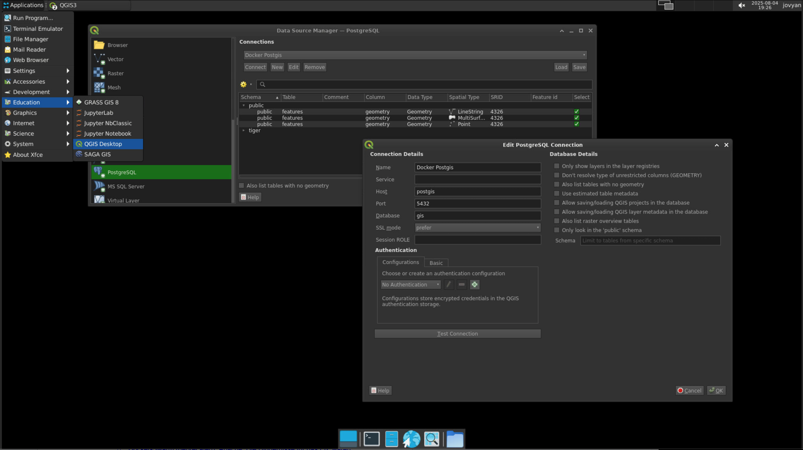
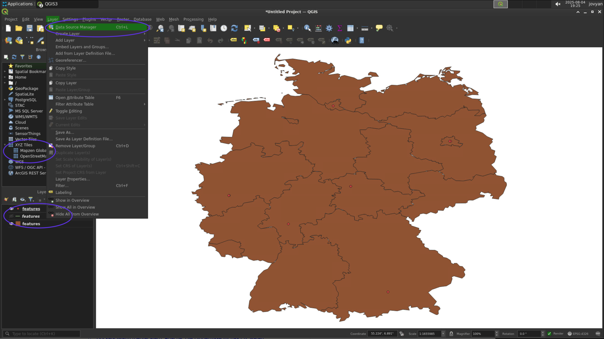

# KARTDOKU - QGIS/GeoDjango Integration Project

This project demonstrates a powerful integration between QGIS and a GeoDjango web application, using a shared PostGIS database. It provides a containerized setup with Docker Compose for easy deployment and development.

The key feature of this setup is the ability to edit geographic data in QGIS and have the changes immediately reflected in the web application, and vice-versa. This is achieved through a PostgreSQL trigger that keeps the data synchronized between the Django model's representation and the raw database tables accessed by QGIS.

## Features

-   **QGIS Desktop Client**: For advanced geospatial data editing and visualization.
-   **GeoDjango Web Application**: To display and interact with the data on a web map.
-   **PostGIS Database**: A shared spatial database serving as the single source of truth.
-   **JupyterLab with QGIS API**: For scripting and data analysis using the QGIS Python API.
-   **Dockerized Environment**: All services are containerized for portability and ease of setup.

## Prerequisites

-   [Docker](https://docs.docker.com/get-docker/)
-   [Docker Compose](https://docs.docker.com/compose/install/)

## Setup Instructions

Follow these steps to get the project up and running.

### 1. Start the Services

First, build and start all the services (PostGIS, GeoDjango, JupyterLab) in the background:

```bash
docker-compose up -d --build
```

### 2. Create a Superuser

To access the Django admin interface, you need to create a superuser account. Run the following command and follow the prompts to set up your username, email, and password:

```bash
docker-compose exec web python manage.py createsuperuser
```

### 3. Set Up the Database Trigger

To enable seamless two-way editing between QGIS and the web application, a database trigger is required. This trigger ensures that the `_attributes` JSON field in the `features` table is always synchronized with the individual data columns.

First, copy the SQL script into the `postgis` container:

```bash
docker cp trigger.sql postgis:/tmp/trigger.sql
```

Then, execute the script inside the container to create the trigger function:

```bash
docker exec postgis psql -U qgis -d gis -f /tmp/trigger.sql
```

### 4. Load Sample Data

Load the sample dataset, which includes layers for major cities, rivers, and states in Germany:

```bash
docker-compose exec web python manage.py load_germany_sample_data
```

## Accessing the Applications

-   **Django Admin**: [http://localhost:8000/admin](http://localhost:8000/admin)
-   **JupyterLab**: [http://localhost:8888](http://localhost:8888) (The token is `your_secure_token_here` as set in `docker-compose.yml`)
-   **PostGIS Database**: Connect from QGIS or any other client using these details:
    -   **Host**: `localhost`
    -   **Port**: `5432`
    -   **Database**: `gis`
    -   **User**: `qgis`
    -   **Password**: `qgis123`

## Project Structure

-   `docker-compose.yml`: Defines and configures the project's services.
-   `Dockerfile.geodjango`: Dockerfile for the GeoDjango web application.
-   `webmap/`: The main Django app containing models, views, and data.
-   `trigger.sql`: The SQL script for the PostGIS database trigger.


## How to start with QGIS


### Accessing QGIS Desktop

1. **Open your VNC viewer** (like RealVNC, TigerVNC, or macOS Screen Sharing)
2. **Connect to the VNC server**:
   - Address: `localhost:5901`
   - Click "Connect"
3. **Enter the password** when prompted: `vncpassword`
4. **In the remote desktop that appears**:
   - Double-click the "QGIS" icon on the desktop
   - Or click the application menu (bottom left) → Education → QGIS Desktop (see [Figure 2](#figure-2))

### Connecting to PostGIS

<a id="figure-2"></a>


*Figure 2: Shows the PostGIS connection in QGIS and the place where QGIS Desktop is placed*

1. In QGIS, go to **Layer** → **Data Source Manager** (or press `Ctrl+L`) (see [Figure 2](#figure-2) and [Figure 1](#figure-1))
2. Select **PostgreSQL** from the left panel
3. Click **New** to create a connection or **Connect** if you have one saved
4. Enter the connection details:
   - Name: `Local PostGIS`
   - Host: `postgis`
   - Port: `5432`
   - Database: `gis`
   - Username: `qgis`
   - Password: `qgis123`
5. Click **OK** then **Connect**
6. In the public schema, you'll find different geometry types (points, lines, polygons)
7. Select the layers you want to add and click **Add**

### Working with Layers

<a id="figure-1"></a>


*Figure 1: Showing layers in QGIS and marks Data Source Manager, XZTiles (OpenStreetMap Background) and Layers that has been added by PostGIS*

1. **Reordering Layers**:
   - In the **Layers** panel (left side)
   - Click and drag layers to reorder them (top to bottom = front to back)

2. **Adding a Base Map**:
   - In the **Browser** panel (left side)
   - Expand **XYZ Tiles**
   - Double-click **OpenStreetMap** to add it as a base layer

### Creating and Editing Features (WIP)

1. **To add a new feature**:
   - Right-click the layer in the **Layers** panel
   - Select **Toggle Editing**
   - Click the **Add Feature** button in the toolbar
   - Click on the map to add points, or click multiple times for lines/polygons
   - Right-click to finish drawing
   - Enter the attribute values in the popup
   - Click **OK** to save

2. **To edit an existing feature**:
   - Make sure the layer is in edit mode (Toggle Editing)
   - Click the **Select Features** tool
   - Click on the feature you want to edit
   - Use the **Node Tool** to move vertices or the **Attributes** panel to edit data
   - Click **Save Layer Edits** to save your changes


## Stopping the Environment

1. **In your terminal**, press `Ctrl+C` if the containers are running in the foreground
2. **Or run**:
   ```bash
   docker-compose down
   ```
